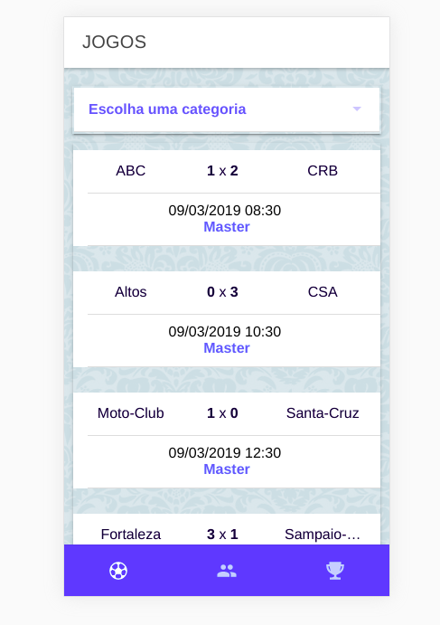

# Futebol dos Pais

> Esse projeto tem como finalidade proporcionar aos jogadores uma visão mais clara do campeonato

## Tela inicial do sistema:



## Instalação:

OS X & Linux:

```sh
npm install  -g ionic@4
npm install  -g cordova
npm i
```

## Ambiente de desenvolvimento:

Para rodar o projeto na web, instale a seguinte extensão:
https://chrome.google.com/webstore/detail/moesif-orign-cors-changer/digfbfaphojjndkpccljibejjbppifbc


## Versões

* 2.0.0
    * Tela inicial
* 2.2.0
    * Tela de equipes
* 2.3.0
    * Tela de artilheiros

